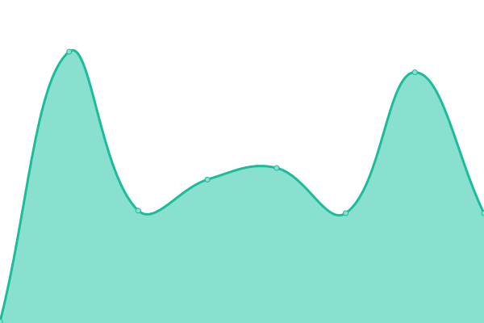
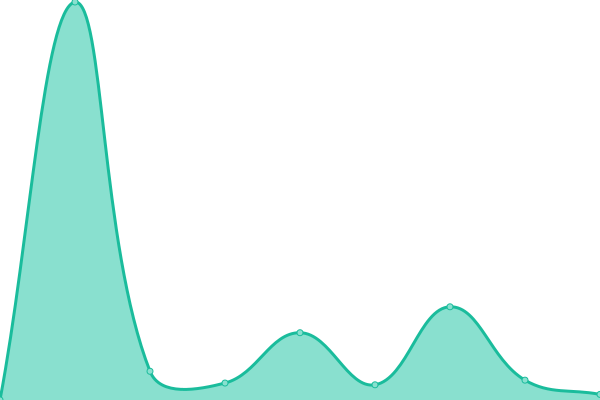
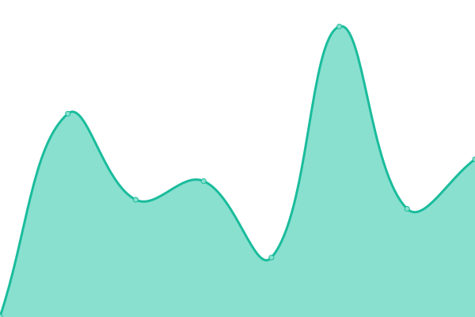

# [📈 Live Status](https://status.zhipenghe.me): <!--live status--> **🟧 Partial outage**

This repository contains the open-source uptime monitor and status page for [Zhipeng He](https://zhipenghe.me/), powered by [Upptime](https://github.com/upptime/upptime).

With [Upptime](https://upptime.js.org), you can get your own unlimited and free uptime monitor and status page, powered entirely by a GitHub repository. We use [Issues](https://github.com/ZhipengHe/upptime/issues) as incident reports, [Actions](https://github.com/ZhipengHe/upptime/actions) as uptime monitors, and [Pages](https://status.zhipenghe.me) for the status page.

<!--start: status pages-->
<!-- This summary is generated by Upptime (https://github.com/upptime/upptime) -->
<!-- Do not edit this manually, your changes will be overwritten -->
<!-- prettier-ignore -->
| URL | Status | History | Response Time | Uptime |
| --- | ------ | ------- | ------------- | ------ |
|  [Homepage](https://zhipenghe.me) | 🟩 Up | [homepage.yml](https://github.com/ZhipengHe/upptime/commits/HEAD/history/homepage.yml) | 

 291ms
     
 | 

<a href="https://status.zhipenghe.me/history/homepage">100.00%</a>
    

|  [Upptime](https://status.zhipenghe.me) | 🟩 Up | [upptime.yml](https://github.com/ZhipengHe/upptime/commits/HEAD/history/upptime.yml) | 

 257ms
     
 | 

<a href="https://status.zhipenghe.me/history/upptime">100.00%</a>
    

|  [URL Shortener](https://zhipe.ng) | 🟩 Up | [url-shortener.yml](https://github.com/ZhipengHe/upptime/commits/HEAD/history/url-shortener.yml) | 

 345ms
     
 | 

<a href="https://status.zhipenghe.me/history/url-shortener">100.00%</a>
    

|  [Onyx](https://onyx.zhipenghe.me) | 🟥 Down | [onyx.yml](https://github.com/ZhipengHe/upptime/commits/HEAD/history/onyx.yml) | 

 1124ms
     
 | 

<a href="https://status.zhipenghe.me/history/onyx">62.66%</a>
    

|  [Glance](https://dashboard.zhipenghe.me) | 🟩 Up | [glance.yml](https://github.com/ZhipengHe/upptime/commits/HEAD/history/glance.yml) | 

 572ms
     
 | 

<a href="https://status.zhipenghe.me/history/glance">100.00%</a>
    

|  RSSHub | 🟩 Up | [rss-hub.yml](https://github.com/ZhipengHe/upptime/commits/HEAD/history/rss-hub.yml) | 

 401ms
     
 | 

<a href="https://status.zhipenghe.me/history/rss-hub">100.00%</a>
    

|  [XAMI Lab](https://www.xami-lab.org) | 🟩 Up | [xami-lab.yml](https://github.com/ZhipengHe/upptime/commits/HEAD/history/xami-lab.yml) | 

 247ms
     
 | 

<a href="https://status.zhipenghe.me/history/xami-lab">100.00%</a>
    

<!--end: status pages-->

[**Visit our status website →**](https://status.zhipenghe.me)

## 📄 License

- Powered by: [Upptime](https://github.com/upptime/upptime)
- Code: [MIT](./LICENSE) © [Anand Chowdhary](https://anandchowdhary.com), supported by [Pabio](https://pabio.com)
- Data in the `./history` directory: [Open Database License](https://opendatacommons.org/licenses/odbl/1-0/)
